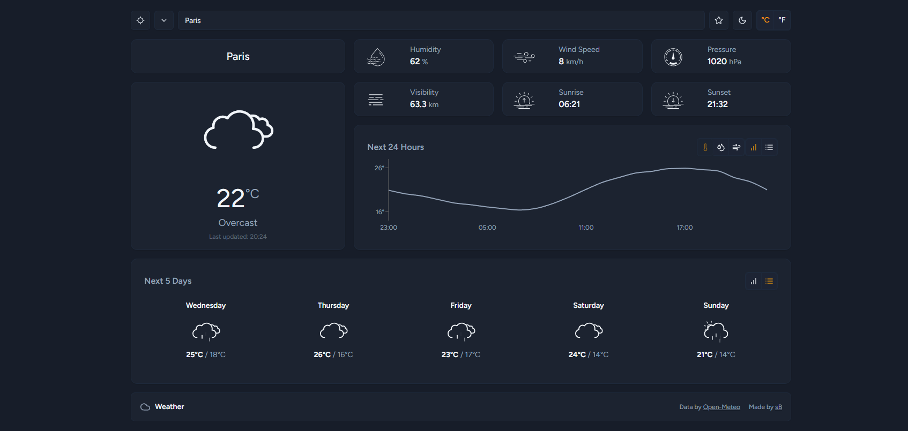

# Weather-NextJS



A modern weather application built with Next.js that provides real-time weather data, detailed forecasts, and a user-friendly, responsive interface.

## 🚀 Live Demo

[https://weather-mage.vercel.app/](https://weather-mage.vercel.app/)

## ✨ Features

-   **Real-time Weather:** Search for any city or use your current location to get up-to-the-minute weather data.
-   **Detailed Forecasts:** View hourly (24-hour) and daily (5-day) forecasts in both chart and list formats.
-   **Comprehensive Data:** Access a wide range of metrics, including temperature, humidity, wind speed, pressure, visibility, and sunrise/sunset times.
-   **User-Friendly Interface:**
    -   Supports light and dark modes.
    -   Switch between metric and imperial units.
    -   Save your favorite locations for quick access.
-   **Modern UI:** A clean, fully responsive design featuring skeleton loading states and animated weather icons.

## 🚀 Tech Stack

-   **Framework:** [Next.js](https://nextjs.org/) 15 (App Router)
-   **Language:** [TypeScript](https://www.typescriptlang.org/)
-   **Styling:** [Tailwind CSS](https://tailwindcss.com/) with [shadcn/ui](https://ui.shadcn.com/)
-   **Charting:** [Recharts](https://recharts.org/)
-   **APIs:**
    -   [Open-Meteo](https://open-meteo.com/) (Weather Data)
    -   [BigDataCloud](https://www.bigdatacloud.com/) (Reverse Geocoding)
-   **Native Features:** [Capacitor](https://capacitorjs.com/) (Geolocation)


### Installation

1.  **Clone the repository:**
    ```sh
    git clone https://github.com/pasteq7/weather-nextjs
    cd weather-nextjs
    ```

2.  **Install dependencies:**
    ```sh
    npm install
    ```
    *Note: No `.env` file or environment variables are required to run this project.*

3.  **Run the development server:**
    ```sh
    npm run dev
    ```

4.  Open [http://localhost:3000](http://localhost:3000) in your browser to see the application.
